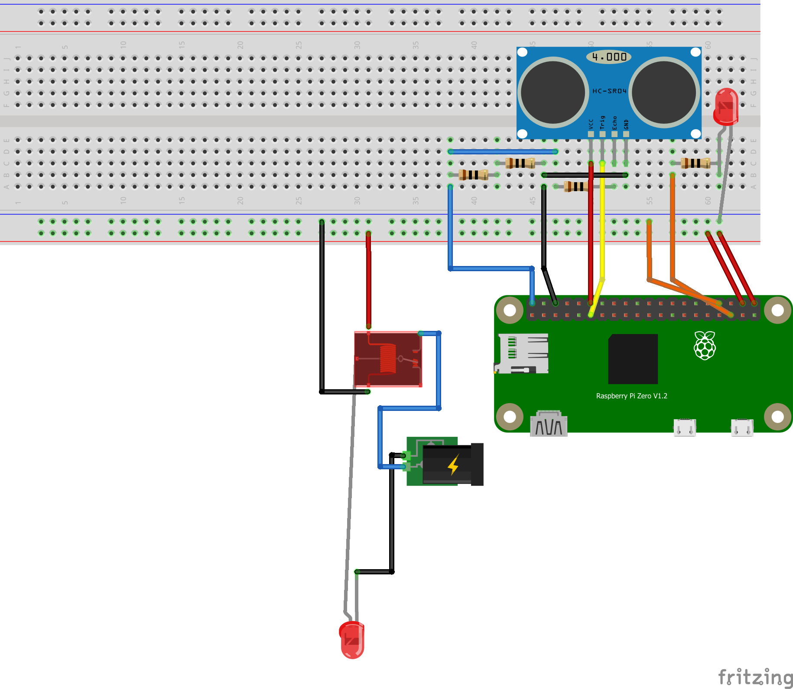

# Wstęp
&nbsp;&nbsp;Repozytorium te zawiera kod do oświetlenia do szafy z dzwiami przesuwnymi. Ideą jest uruchomienie paska led po wystarczającym odsunięciu drzwii. Dodatkowo w celu zbierania logów i bezpieczeństwa wprowadzone zostało połączenie z bazą danych, do której przekazywane są informacje o czasie otwarcie i zamknięcia szafy.

&nbsp;&nbsp;Mimo, iż głowna funkcjonalność projektu została już zaimplementowana projekt ciągle jest rozwijany i planowane jest stworzenie alarmu i prostego REST API.

# Wymagane elementy
&nbsp;&nbsp;Na ten moment, elementy i moduły, które zostały użyte to:
- [Raspberry Pi Zero W ](https://botland.com.pl/moduly-i-zestawy-raspberry-pi-zero/8330-raspberry-pi-zero-w-512mb-ram-wifi-bt-41-5904422311513.html)
- [Pasek LED 💡](https://botland.com.pl/paski-led-standardowe/9682-zestaw-pasek-led-smd3528-ip20-48w-60-diodm-barwa-zimna-5m-zasilacz-12v3a-5904422313937.html)
- [Czujnik odległości 📐](https://botland.com.pl/ultradzwiekowe-czujniki-odleglosci/5686-ultradzwiekowy-czujnik-odleglosci-hc-sr04-2-200cm-uchwyt-montazowy-5904422308452.html) (*HC-SR04*)
- [Czunik dotyku 👆](https://sklep.avt.pl/czujnik-dotykowy-pojedynczy-ttp223-14x11mm-touch-sensor-do-arduino.html) (*TTP223*)
- [Przekaźnik ⚡](https://eu.mouser.com/ProductDetail/Fujitsu/FTR-C1CA003G?qs=s3tcQNyrmfkYgMQNKN9cBg%3D%3D) (*FTR-C1CA003G*)

&nbsp;&nbsp;Prócz fizycznych elementów opcjonalne są poniższe pliki w katalogu projektu:
#### - **adres.txt** - jeżeli jest obecny wysyła informacje na temat otwarcia i zamknięcia szafy do bazy danych. Musi zawierać trzy linie:
 
1. Adres IP i port serwera z bazą danych
2. Login użytkownika
3. Hasło użytkownika

#### - **auth.txt** - jeżeli jest obecny wymaga przed wejściem na stronę (czy API) autoryzację za pomocą nagłówka Autorization basic. Musi zawierać dwie linie:
 
1. Login użytkownika
2. Hasło

#### - **sinricpro_login.txt** - jeżeli jest obecny pozwala na dodanie szafy jako urządzenia w aplikacji [SinricPro](https://portal.sinric.pro/dashboard). Musi mieć trzy linie:
1. APP_KEY
2. APP_SECRET
3. DEVICE_ID

#### - **smtp.txt** - jeżeli jest obecny, wysyła informację na gmail o otwarciu, zamknięciu szafy oraz czasie trwania. Wymagane 4 linie:
1. Email działający jako serwer SMTP (sender)
2. Hasło na email (sender)
3. Email (receiver)
4. Minimalny czas trwania (w sekundach) statusu, po którym zostanie wysłana wiadomość na mail.
 
W przypadku wykorzystania gmail-a należy włączyć logowanie dwu-etapowe i ustawić [hasło aplikacji](https://support.google.com/mail/answer/185833?hl=en).
Więcej informacji można [znaleźć tutaj](https://realpython.com/python-send-email/#option-1-setting-up-a-gmail-account-for-development).


### - ***Wymaga minimalnej wersji python-a w wersji 3.9.7***

Aby zainstalować na Raspberry Pi Zero:
```
wget https://www.python.org/ftp/python/3.9.7/Python-3.9.7.tar.xz
cd Python-3.9.7
./configure --enable-optimizations
make -j4
sudo make altinstall
```

# Struktura tabeli w bazie
<table>
  <tr>
    <th>ID</th>
    <th>Data</th>
    <th>Stan</th>
    <th>Dlugosc</th>
    <th>CzyStartowe</th>
    <th>CzyOffline</th>
  </tr>
    <tr>
    <th>int</th>
    <th>datetime2</th>
    <th>bit</th>
    <th>float</th>
    <th>bit</th>
    <th>bit</th>
  </tr>
 </table>

# Funkcje i plany
- [X] Mierzenie odległości
- [X] Włączanie i wyłączanie przekaźnika zapalającego pasek LED
- [X] Zapisywanie informacji o godzinie otworzenia i zamknięcia szafy
  - [X] Asynchroniczne łączenie z bazą danych
  - [X] Zapisywanie do pliku **temp.txt** w przypadku braku połączenia
  - [X] Przekazywanie informacji z pliku do bazy po ponownym połączeniu
  - [X] Wyłączenie łączenia z bazą, jeżeli nie wykryto pliku **adres.txt**
- [X] Wyłączenie światła po dotknięciu czujnika do czasu zamknięcia szafy lub ponownego dotknięcia (*funkcja nadpisu*)
- [ ] Mechanizm przypominający o zamknięciu szafy
  - [X] Uruchamianie funkcji po określonym czasie
  - [ ] Alarm dźwiękowy przez [buzzer 🔈](https://botland.com.pl/buzzery-generatory-dzwieku/786-buzzer-z-generatorem-5v-12mm-tht-5904422366940.html)
  - [ ] Edytowanie głośności alarmu poprzez [potencjometr 10kΩ ⚙](https://botland.com.pl/potencjometry-obrotowe-suwakowe-i-liniowe/4679-potencjometr-obrotowy-10k-liniowy-18w-5szt-5904422332990.html)
- [ ] Stworzenie API
  - [X] Uruchomienie serwera za pomocą socketa
  - [ ] Edytowanie konfiguracji programu za pomocą przeglądarki (czas do alarmu, wyłączenie alarmu, głośność)
- [ ] Stworzenie aplikacji mobilnej do wyświetlania danych i edytowania konfuguracji
- [ ] Możliwość wyłączenia i włączenia
- [X] Połączenie z aplikacjami typu smart home (Google Home, SinricPro)

# Diagram połączenia

